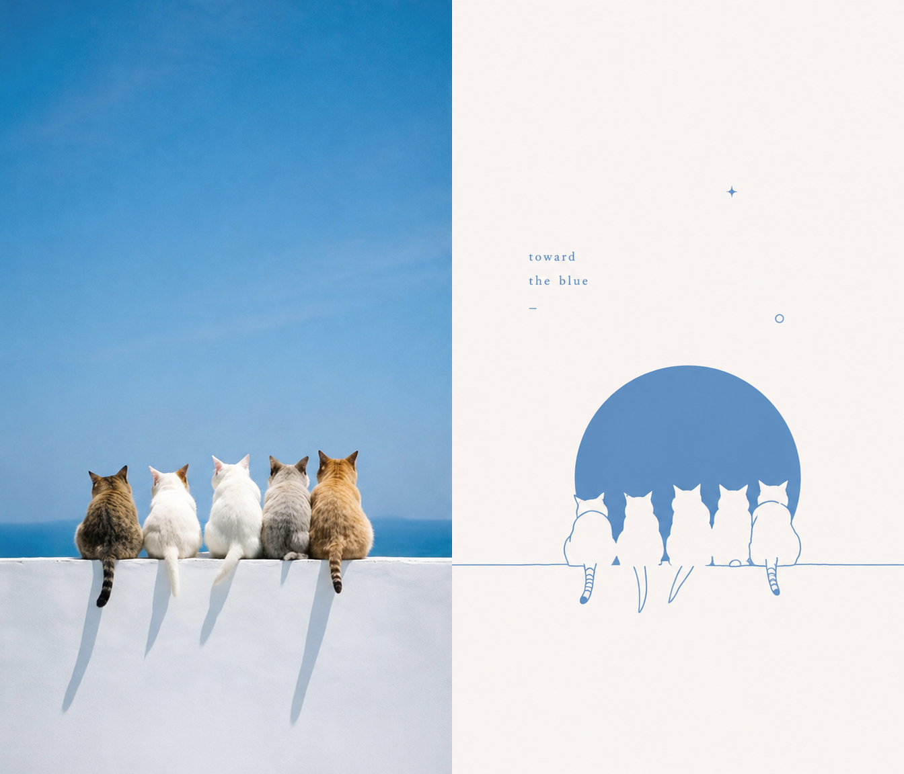
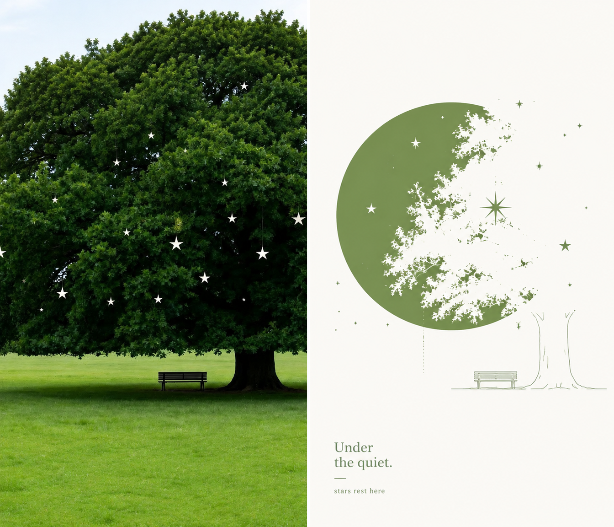
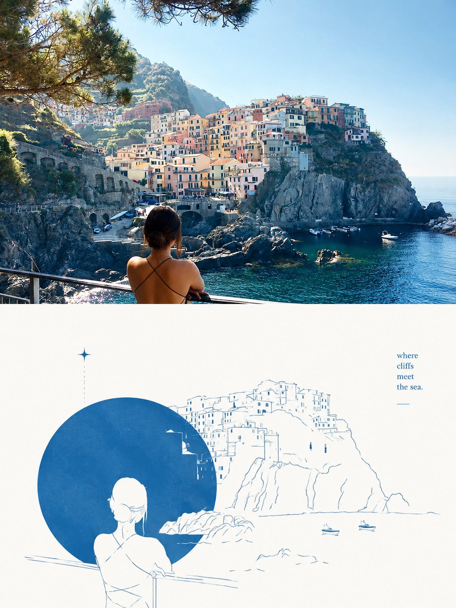
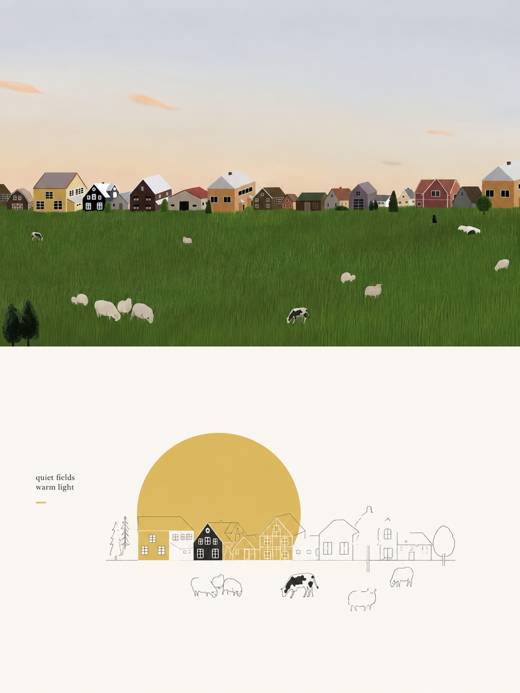

<div align="center">

# XXD Panel 144｜خط هندسي بتفريغ أبيض

أعد إخراج صورة يومية كملصق فني مستقل، مع حفظ جوهرها المميز وإعادة التفكير في الخامة والتكوين والفراغ.

<a href="README.md">简体中文</a> · <a href="README.en.md">English</a> · <a href="README.ja.md">日本語</a> · <a href="README.ko.md">한국어</a> · <a href="README.ar.md">العربية</a>

</div>

يتبع الإخراج الافتراضي التعديل الأخير في الأصل: يسار–يمين بنسبة 7:6 وتقسيم 50:50، الأصل يساراً والتصميم يميناً. استخدم أعلى–أسفل 3:4 فقط عند اختياره صراحة. التعديل يستبدل التخطيط الأولي لا الجماليات.

## عرض النماذج

تستخدم النماذج التالية مراجع أصلية مختلفة. أنشأ Panel 144 كل عمل بصورة مستقلة وفي جولة توليد واحدة، وقد أزيلت البيانات الوصفية للذكاء الاصطناعي. النماذج الأفقية تقسيمها صارم 50:50: الواقع يساراً والتصميم يميناً؛ والنماذج العمودية تقسيمها صارم 50:50: الواقع أعلى والتصميم أسفل.

**7:6 أفقي · يسار/يمين 50:50**

| sample-05 | sample-06 |
|---|---|
|  |  |
|  |  |

**3:4 عمودي · أعلى/أسفل 50:50**

| sample-09 | sample-10 |
|---|---|
|  |  |
|  |  |

تستخدم النماذج عبارات إنجليزية قصيرة وذكية مستمدة من كل صورة أصلية.

## الحالات المناسبة والمشكلات التي يحلها

مناسب لمجموعات الصور الشخصية والنشر المستقل ودراسات المعارض والمرئيات اليومية. التكوين الضعيف أو الخلفية المزدحمة أو الموضوع الصغير نقطة انطلاق للاختزال وإعادة الترتيب والقص وتغيير المقياس، لا مجرد تطبيق فلتر.

اتخذ في الأسفل قراراً فنياً جديداً، مستخلصاً الموضوع والحدود والبنية والوضع والعلاقات السردية الأكثر تميزاً فقط. لا تنسخ الصورة كلها ولا تحتفظ بخلفية غير مرتبطة وأغراض ثانوية. احذف معظم المعلومات وأبقِ اتجاه البنية وذاكرتها البصرية، ثم أعد خلقها بخطوط بسيطة وكتلة هندسية لونية وتفريغ أبيض موجب/سالب وتراكب يكسر الحدود. اجعل علاقتها بالأصل واضحة فوراً، دون مظهر إعادة رسم بسيطة.

## الموجّه الأصلي · خمس لغات

[简体中文](references/original-prompt/zh-CN.md) · [English](references/original-prompt/en.md) · [日本語](references/original-prompt/ja.md) · [한국어](references/original-prompt/ko.md) · [العربية](references/original-prompt/ar.md)

يحفظ الملف الصيني نص المستخدم الأصلي حرفياً وهو المرجع الوحيد للإبداع والجماليات أثناء التشغيل. الملفات الأربعة الأخرى ترجمات كاملة وأمينة للقراءة ولا تعيد كتابة تعليمات التوليد.

## فحص الملاءمة السريع

احفظ هوية الأصل مع إعادة إخراج التكوين، واجمع ملمس الخامة والفراغ المقصود. اختر نصاً حرفياً أو مولداً أو بلا نص، مع معالجة صورة واحدة أو مجلد متداخل والأنماط الأربعة أدناه.

## منطق التحويل

فهم الموضوع والعلاقات ← استخلاص لغة النص الأصلي ← حذف التفاصيل غير المرتبطة ← إعادة تكوين المقياس والموقع والفراغ ← كلمات قليلة من الصورة ← فحص النسب والنص والنتيجة

## سمات النتيجة

استهدف رسماً مسطحاً راقياً يجمع الخط والتفريغ الأبيض وكسر الحدود والمرساة الهندسية والفراغ الهائل والطباعة التحريرية. تجنب نسخ كل غرض وكثرة الخلفية والرسم الواقعي وتكديس التفاصيل والملء الكامل والظلال الثقيلة والتدرجات المعقدة والكرتون و3D والتخطيط القالبي.

## أنماط الإخراج الأربعة

- `top-bottom`: منطقتان أفقيتان كاملتا العرض فقط؛ الواقع في الأعلى والتصميم في الأسفل، 50% لكل منهما.
- `left-right`: منطقتان عموديتان كاملتا الارتفاع فقط؛ الواقع يساراً والتصميم يميناً، 50% لكل منهما، ولا يتحول إلى تخطيط علوي/سفلي.
- `design-only`: تعرض اللوحة الكاملة ترجمة Panel 144 التصميمية فقط، وتبقى الصورة مرجعاً غير ظاهر.
- `wallpaper-pack`: ينشئ عملاً كاملاً للهاتف وiPad وسطح المكتب والساعة، إما كعائلة `linked` أو أربعة أعمال `independent`.

يمكن جمع الأنماط والأحجام. تشمل النسب `1:1` و`3:4` و`4:3` و`4:5` و`5:4` و`2:3` و`3:2` و`9:16` و`16:9` و`21:9` و`5:7` و`7:5` والبكسلات الدقيقة. يمكن أن يكون النص مولداً أو حرفياً من المستخدم أو غائباً. عند إدخال مجلد، تُعالج كل صورة بمعزل عن الأخرى مع إعدادات تسليم مشتركة، وتوضع ملفات PNG النهائية مباشرة في مجلد مهمة جديد واحد.

## البدء

```bash
git clone https://github.com/nevertoday/xxd-panel-144.git
npx skills add https://github.com/nevertoday/xxd-panel-144 --skill xxd-panel-144
```

بعد التثبيت أعد تشغيل جلسة Agent ثم استدعِ `$xxd-panel-144`. ويمكن إضافة `--global --agent codex --yes` للتثبيت على مستوى المستخدم.

```text
/xxd-panel-144 photo.jpg --mode top-bottom --size 3:4 --text prompt --locale ar-SA
/xxd-panel-144 photo.jpg --mode left-right --size 7:6 --text prompt --locale en-US
/xxd-panel-144 photo.jpg --mode design-only --size 9:16 --text none
```

راجع [SKILL.md](SKILL.md) لعقد التشغيل الكامل، ومهايئ التشغيل [بالإنجليزية](references/xxd-panel-144-prompt.en.md) أو [بالصينية](references/xxd-panel-144-prompt.zh-CN.md).

## الترخيص

يخضع هذا المشروع—بما فيه Skill والموجّهات والبرامج النصية والوثائق ونماذج الصور المرفقة—لترخيص **PolyForm Noncommercial License 1.0.0**. راجع [LICENSE](LICENSE) للاطلاع على النص القانوني الكامل، و<https://polyformproject.org/licenses/noncommercial/1.0.0> للصفحة الرسمية.

بلغة بسيطة:

- يجوز للأفراد استخدامه للتعلم والبحث والتجارب والاختبار ومشاريع الهوايات والترفيه الخاص. كما يجوز للجمعيات الخيرية والمؤسسات التعليمية وهيئات البحث أو السلامة أو الصحة العامة ومنظمات حماية البيئة والمؤسسات الحكومية استخدامه.
- للأغراض **غير التجارية**، يجوز لك استخدامه ونسخه وتعديله وإنشاء أعمال مشتقة منه ومشاركته. وعند المشاركة، يجب إرفاق هذا الترخيص (أو الرابط أعلاه) وجميع عبارات `Required Notice:` التي قدمها المؤلف.
- لا يجوز استخدامه في منتجات أو خدمات تجارية، أو تسليمات مدفوعة، أو بيع حق الوصول أو التراخيص، أو أي استخدام متوقع أن يؤدي إلى تطبيق تجاري. احصل على إذن كتابي منفصل من صاحب حقوق النشر قبل الاستخدام التجاري.
- لا تمنح الاتفاقية سوى ترخيص حقوق النشر والترخيص المحدود لبراءات الاختراع المنصوص عليهما صراحةً. ولا تمنح علامات تجارية أو أسماء علامات أو حقوقاً أخرى غير مذكورة، ولا يجوز لك منح ترخيصك من الباطن للآخرين.
- إذا تلقيت إشعاراً كتابياً بمخالفة، فعليك العودة إلى الامتثال واتخاذ خطوات عملية لمعالجة المخالفة خلال 32 يوماً، وإلا تنتهي التراخيص فوراً. كما يؤدي الادعاء الكتابي بانتهاك براءة اختراع إلى إنهاء ترخيص البراءة.
- تُقدَّم المواد «كما هي» ومن دون أي ضمان بالقدر الذي يسمح به القانون. ويتحمل المستخدم مخاطر الاستخدام وخسائره المحتملة.
